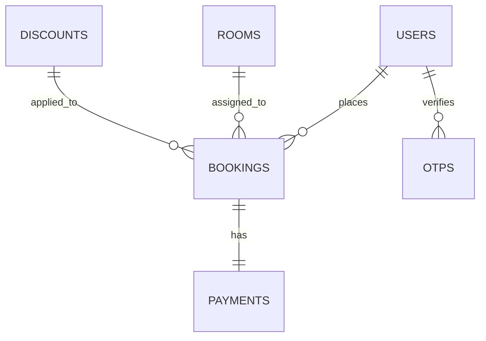

# Database Schema

Core tables:
- `users`
- `otps`
- `rooms`
- `discounts`
- `bookings`
- `payments`

Highlights:
- OTPs are stored as hashes
- bookings reference users, rooms, and optional discounts
- payments keep a unique one-to-one booking relationship
- indexes support room filtering, booking conflict checks, and payment lookups
